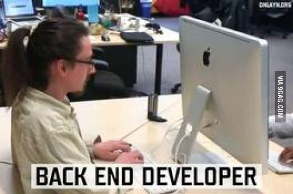
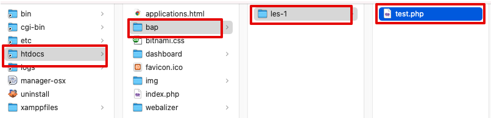

# F2M3 Duurzaam Huis - Backend programming

---

In deze repository maak je deze periode ALLE opdrachten voor de lessen Backend Programming (BAP)

Op deze website vind je elke week de opdrachten voor de les: [https://bit.ly/duurzaam-huis-bap](https://bit.ly/duurzaam-huis-bap)

## Werkwijze

- Maak voor elke les een aparte folder aan: `les-1`, `les-2` (geen spaties, speciale karakters of hoofdletters a.u.b)
- Maak de opdrachten in deze folder.
- Commit en push je werk zo vaak en veel mogelijk
- Zo kunnen docenten je voortgang en code zien en feedback geven.

---

### Nadat je de XAMPP webserver hebt geinstalleerd

Als je de XAMPP webserver met PHP en MySQl hebt geinstalleerd verplaats je deze repository folder naar de XAMPP htdocs folder.

- Verplaats deze repository folder (de folder waarin deze README in staat) naar de `htdocs` folder van je XAMPP webserver.
- Hernoem de map naar een korte makkelijker naam, bijvoorbeeld: `bap`.
- Start de Apache en MySQL server in het XAMPP control panel als je aan Backend Programming opdrachten werkt.

### Voorbeeld

Heb je bijvoorbeeld voor Les 1 een map `les-1` gemaakt met daarin een PHP bestand `test.php`, dan kun je die via je webserver opvragen op: [http://localhost/bap/les-1/test.php](http://localhost/bap/les-1/test.php)

**Veel succes!**
